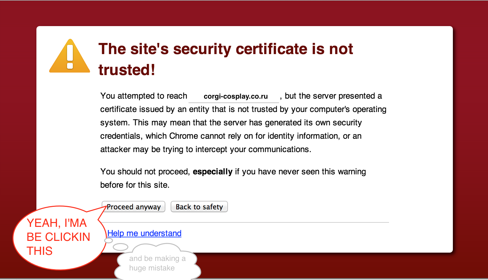

You're not the only one; we've all done it. We've all at some
point gone *too deep into the internet*.

You know what I mean...this deep.




# SSLOL: The "Proceed Anyways" for Scala web requests

Are you a scala programmer?

Are you the kind of person who gets too damned excited to bother
with *Certificate Authorities*, *Trusted Keys*, or *Seatbelts*?


If so:

  * *DO* use this library to temporarily, programmatically enable web requests against specific sites
    that publish self-signed certificates or certificates signed by an unauthoritative party.

  * *DO NOT* get within 1000 yards of myself or anyone I love

# Main features

  * Make web requests over SSL with sites whose certs are not signed by known
    Certificate authorities.

  * Store these custom untrust-stores for later use in shooting yourself in
    the foot.

  * Or choose not to store them, preferring do everything programmatically. Because why shouldn't you be able to?

  * Is not `keytool`

# Usage

*Get it into your project*
```bash
# Haha what's dependency management? Just dump this stupid file into your project's source directory.
#   (this is the first of many mistakes you will make using SSLOL)
curl https://raw.github.com/eboto/SSLOL/1.0/SSLOL.scala > $HOME/projects/my-project/src/main/scala/SSLOL-1.0.scala
```

```scala
// Somewhere in your application
...
import sslol.{SSLOL, Site}
...
  def makeUnsafeRequests = {
    // Want to live life on the edge? Accept any old certificate you get.
    SSLOL trust "evil.com" inPlayground {
      // Any SSL connection you make while in this playground will accept
      // the certs from evil.com
    }

    // You can trust a couple sites at a time...
    SSLOL trust "evil.com" trust "veryevil.com" trust "superevil.com" inPlayground {
      // Why, why, why are you doing this?
    }

    // A little safer. Expect the cert's SHA hash to begin with some expected chars.
    SSLOL trust Site("evil.com", certShaStartsWith="a1dff43") inPlayground {
      // Any SSL connection you make in this playground will accept the certs
      // from evil.com, as long as one's sha started with "a1dff43"
    }

    // Specify a port if you want...
    SSLOL trust Site("evil.com", port=443) inPlayground { /* do things in here */}

    // Want async? that's cool. The playground will clean up immediately after the Future
    // is realized.
    val futureResult: Future[Int] = SSLOL trust "evil.com" inPlayground { getSinCountFromEvilDotCom() }

    // Or enable SSLOL statefully, to control the playground's lifecycle in a larger application
    val ssl = SSLOL trust "evil.com"
    ssl.openPlayground()
    // Be careful to close the playground, or the untrust-store will leak to the rest
    // of your JVM!
    ssl.closePlayground()

    // Create, store, load, and use custom untrust stores
    val ssl = SSLOL trust "evil.com"
    ssl store "evil.jks" // You could also provide a password if you want

    SSLOL load "evil.jks" inPlayground { /* shenanigans */ }
  }
}
```

# Frequently Asked Questions

### What do you use SSLOL for?

  * I use it to make requests against internal services that use self-signed certs (Confluence, I'm looking at you!)

  * I use it to write integration tests against locally hosted apps over https despite
    that they don't yet have CA-signed certs.

  * I use it to make terrible, life-altering mistakes.


### How do you suggest using SSLOL

*I do not suggest using SSLOL*


### Wait a second, how safe is this library?

This library is about as safe as unprotected sex.


### So why did you build it?

Because I am not a smart man.